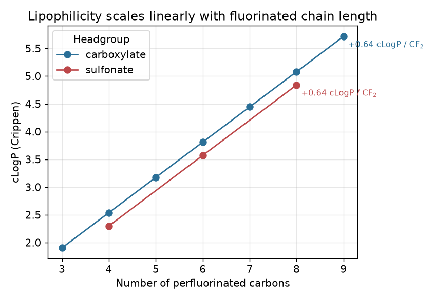
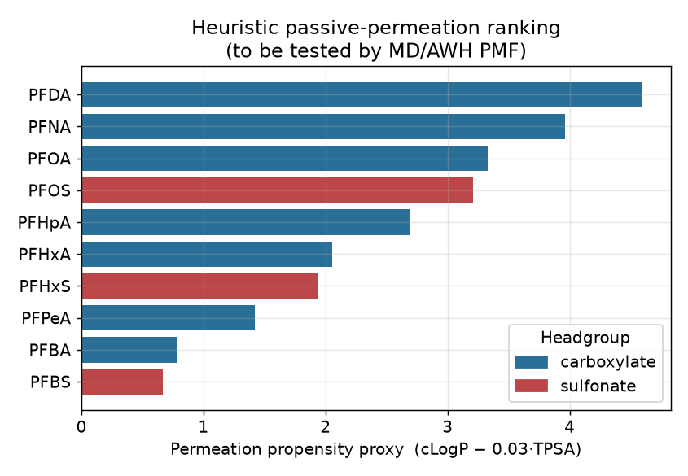
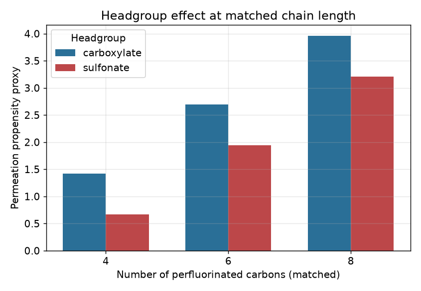

# PFAS Passive-Permeation Descriptor Analysis — a working note

A small, self-contained study exploring how **chain length** and **headgroup
chemistry** govern the membrane-permeation propensity of per- and polyfluoroalkyl
substances (PFAS), using RDKit-derived physicochemical descriptors.

It is written as preparatory work for the PhD project *"In Silico Biophysical
Characterization of PFAS Toxicokinetics"* (Di Meo / Fabre, Inserm U1248,
Univ. Limoges). It is deliberately scoped to be **honest about what it is and is
not**: a fast, interpretable descriptor-based proxy that generates falsifiable
hypotheses for molecular dynamics (MD) to test — not a substitute for the
free-energy calculations (PMF via the AWH protocol) that the project will perform.

---

## 1. Motivation

The project's first axis is **passive permeation modelling**: computing potential-
of-mean-force (PMF) profiles of PFAS crossing lipid bilayers to predict partition
coefficients and permeation rates across a broad PFAS library.

A PMF calculation with enhanced sampling is expensive. Before committing MD time,
it is useful to ask: *which physicochemical descriptors plausibly drive permeation,
and what ordering of compounds would we expect?* If a cheap descriptor model and an
expensive MD model disagree, that disagreement is scientifically informative.

This note builds that cheap model and states the hypotheses explicitly so they can
be confirmed or falsified later.

## 2. Compounds

Ten well-characterised PFAS spanning two headgroup classes and a range of
perfluorinated chain lengths (C3–C9):

- **Carboxylic acids:** PFBA, PFPeA, PFHxA, PFHpA, PFOA, PFNA, PFDA
- **Sulfonic acids:** PFBS, PFHxS, PFOS

All SMILES were validated by checking that the RDKit-derived molecular formula
matches the known formula of each compound (see `src/compute_descriptors.py`;
a standalone check is in the commit history). 10/10 match.

> Note on protonation state: descriptors are computed on the neutral acid form for
> consistency. At physiological pH these compounds are anionic, which *increases*
> the real desolvation penalty for the headgroup. This is a known limitation and is
> exactly the kind of effect explicit-solvent MD captures and a descriptor model
> cannot. It is flagged here rather than hidden.

## 3. Descriptors

Computed with RDKit: molecular weight, **cLogP** (lipophilicity / bilayer-core
partitioning proxy), **TPSA** (polar surface area / desolvation-penalty proxy),
H-bond donors and acceptors, rotatable bonds, and fluorine fraction.

A transparent heuristic ranking score is defined as:

```
permeation_proxy = cLogP − 0.03 × TPSA
```

The coefficients are illustrative, not fitted — the point is the *ordering* and the
*direction* of each effect, both of which are mechanistically motivated and testable.

## 4. What the data show



- **cLogP increases linearly with chain length**, ~+0.64 per CF₂ for both headgroup
  classes. Each fluorinated carbon adds a near-constant lipophilic increment, as
  expected for an apolar tail.
- **At matched chain length, sulfonates carry a higher TPSA** (54.4 vs 37.3 Ų) and
  therefore a larger modelled desolvation penalty than carboxylates.



The proxy ranks long-chain carboxylates (PFDA, PFNA, PFOA) highest and short-chain
sulfonates (PFBS) lowest.



Headgroup chemistry matters most at short chains and is progressively outweighed by
the tail as chain length grows.

## 5. Hypotheses for MD to test

1. **Monotonic chain-length effect on permeability.** The PMF barrier for crossing
   the bilayer should decrease (permeability increase) with chain length — up to the
   point where the very-long-chain anions become kinetically trapped in the headgroup
   region. A descriptor model *cannot* see that turnover; MD should.
2. **Headgroup desolvation dominates the barrier at the water/headgroup interface.**
   Sulfonates should show a higher interfacial free-energy barrier than
   chain-matched carboxylates.
3. **Proxy/PMF disagreement is expected for the longest chains** because the proxy is
   monotonic by construction and real permeation is not — this is the most
   interesting place to look.

## 6. Bridge to the experimental side (organ-on-chip)

The descriptor → MD/PMF → affinity-constant pipeline is one half of a loop. The
other half is experimental: the group's recent review (*Petit, Di Meo, Vedrenne et
al., Drug Metab Dispos 2026*) argues that organ-on-chip platforms should move beyond
using transporters as identity biomarkers, toward **quantitative kinetics**
(Kₘ, V_max, CL_int) feeding **PBPK / digital-twin** models in a closed feedback loop.

The natural endpoint of the in silico work is to produce affinity and permeability
constants in exactly the form those digital-twin models consume — so that a
prediction from MD can be cross-validated against an organ-on-chip measurement, and
disagreements drive the next round of both. That closed loop between simulation and
microphysiological measurement is the direction I am most motivated to work in.

## 7. Honest limitations

- Descriptor proxy, not a permeability coefficient. No free energies here.
- Neutral-form descriptors; physiological anionic state not modelled.
- No transporter binding yet — this note covers only the passive-permeation axis.
- The `md_trajectory_demo.py` script analyses an *existing* bundled trajectory
  (adenylate kinase) to demonstrate familiarity with the MDAnalysis ecosystem and
  with conformational-change analysis (RMSD, radius of gyration). **I have not yet
  run a production MD simulation** — building that skill on GROMACS is part of why
  this project interests me.

## 8. Reproduce

```bash
pip install rdkit pandas numpy matplotlib MDAnalysis MDAnalysisTests
python src/compute_descriptors.py     # writes data/pfas_descriptors.csv
python src/plot_trends.py             # writes figures 01–03
python src/md_trajectory_demo.py      # writes figure 04
```

---

*Author: Sema Nur Bozdağ — MSc Bioinformatics & Systems Biology, Istanbul University.*
*Background spanning wet-lab embryology and deep-learning-based bioimage analysis;
moving toward computational modelling of molecular transport across biological
barriers.*
